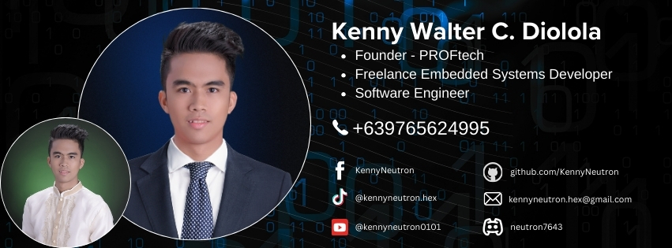

<!-- Header -->
<!--
<h2 align="center">🚀   Welcome to Kenny Neutron's GitHub Profile!   🚀</h2>

  <samp>Hello there! I'm Kenny Neutron, an inventor, entrepreneur, and passionate advocate for innovation.</samp>
   
  <samp>Let's explore the world of technology together!</samp>

-->
<!--  -->

  

  

<h3 align="left">Languages and Tools:</h3>

  
  
  
  
  
  
  
  

  
  
  
  
  
  
  
  

  
  
  
  
  

  
  
  
  
  
  
  

    

        
    

    

        
    

<!--

<!-- Connect with Me -->

## Connect with Me ✉️
Click any of the following to connect with me

  

  

  

  

  

<!--
Let's connect via  and  to stay updated!
-->

<!-- What I Do -->
## 🌟 What I Do

I transform ideas into reality through the art of embedded systems, crafting seamless integrations of hardware and software. My expertise lies in:

- ⚙️ **Embedded Systems:** Breathing life into microcontrollers (ATmega, PIC) with precision programming in C, C++, Assembly(ASM), & GPL.

- 💻 **Code Wizardry:** Writing elegant, efficient, and scalable code that powers innovation.

- 📐 **PCB Design:** Designing multi-layered (1-20 layers) PCBs, merging functionality with finesse.

- 📦 **Product Development:** Melding electronics with product casing designs in SketchUp for holistic solutions..

- **🖥️📲 Software Development**: Python, C#, ProcessingIDE, MITAI, Java, Kotlin, & Dart.
  - **🖥️ Desktop Applications**:  Crafting robust, user-friendly applications to enhance productivity and solve complex problems. 
  - **📲 Mobile Applications**:   Building intuitive, feature-rich apps that deliver seamless user experiences on the go.
 
- 🔌 **Engineering Consumer Electronics Products:**
    - Designing functional, innovative consumer electronics, from concept to production.
    - Ensuring optimized performance, user-centric features, and manufacturability.
    
- 🎮 **Simulations:** Bringing circuits to life in virtual worlds using tools like Proteus.

- 🚀 **Innovation:** From locking systems powered by fingerprints to networked systems crunching data, I embrace challenges that shape the future.

## 🌟 Career Profile
- Certified Arduino Programmer (Arduino CC, Italy) [Verify Certificate](https://certifications.arduino.cc/certificate/8a62aade-ed14-486f-b801-875845a5f9aa)
- On-Call Software Engineer- BRINT Industrial Development Corporation (2024)
- Tech-Lead and FounderPROFtech Consumer Electronics (2023)
- Embedded Systems Engineer- GER-PER Engineering (2019-2022)
- Co-Founder- [SIRENA AI](https://www.facebook.com/Sirena.fb) (2021)
- SHS Teacher- [Notre Dame of Kidapawan College](https://ndkc.edu.ph) (2021-2022)

## 🎓 Education
- 2019 (Graduated) -BS Electronics Engineering
- 2014 (Graduated) -High School(Special Science Curriculum)-Researcher of the Year
- 2010 (Graduated) -Elementary

<!-- IDEs and CAD Software I Use -->
## IDEs and CAD Software I Use 💻🛠️
Here are the IDEs and CAD software I use for my projects:
  - Visual Studio Code (VSC)
  - Arduino IDE
  - Android Studio
  - KiCAD
  - MPLab
  - Processing IDE
  - Flowcode
  - EagleCAD
  - Target3001!
  - Proteus
  - Sketchup

<!-- Rates -->
## Professional Rates
- **Consumer Projects:** $15-$30/hr
- **Industrial Projects:** $30-$80/hr

## Achievements 🏆🥇🥈🥉

**PROFESSIONAL:**
- **3rd Placer-** Department of Science and Technology Regional Invention Contest 2021 (General Santos City)
- **Graduate-** Batch 4 Mindanao Startup Challenge 2022 (MSU-IIT, Iligan City)
- **Finalist-** (1st Runner-Up) – Philippine Startup Challenge- Regional Level 2022
- **Finalist-** Philippine Startup Challenge- National Level 2022
- **Finalist** (2nd Runner-Up)- Qompete Technopreneurs Challenge 2022

**STUDENT:**
- **3rd Placer-** Department of Science and Technology National Invention Contest 2018 (Pasay City)  
- **1st Placer-** Department of Science and Technology Regional Invention Contest 2017 (General Santos City)  
- **Most Innovative Research-** Department of Science and Technology (DOST)- Regional Invention Contest 2016  
- **Representative-** DOST- Regional Invention Contest under Creative Research (2014, 2016, 2017, 2021)  
- **Best Individual Physical Science Research-** 2013 [Intel](https://www.intel.com/content/www/us/en/homepage.html) National Science and Technology Fair (Tagaytay City)  
- **1st Placer-** 2013 Regional Integrated Competition- Applied Science Research 2013 (General Santos City)  
- **1st Placer-** Division Level Science Fair for Applied Science Research (2011, 2012, 2013)  
- **1st Placer-** School Level Science Fair for Applied Science Research (2011, 2012, 2013)  
- **Researcher of the Year** (2011, 2012, 2013)

<!-- About Me 
## About Me 🧠
- 🛠️ Inventor Extraordinaire
- 💼 Founder of PROFtech
- 🎓 Bachelor of Science in Electronics Engineering

  

-->

<!-- My Journey -->
## My Journey 🚀
My journey as an inventor and entrepreneur has been marked by a relentless pursuit of innovation and a passion for pushing the boundaries of what's possible. From my early beginnings, I've always been driven by a curiosity to explore and create, leading me to craft innovative projects that have garnered recognition and acclaim.

**Early Years:**  
Kenny Neutron, born on May 28, 1997, entered the world with an innate curiosity that would shape his future endeavors. Growing up, he discovered a profound passion for invention, an inclination that would define his life's trajectory.

**High School Innovations:**  
Kenny's journey as an inventor began to gain momentum during his high school years. His exceptional aptitude for applied science earned him a coveted spot in the special science curriculum, setting the stage for a series of groundbreaking inventions. In 2011, the Goat Manure Battery marked his first notable invention, followed by the Rain Powered Generator in 2013. The latter not only garnered acclaim at the school level but also qualified for the prestigious 2013 Intel Science and Technology Fair, where it emerged as one of the Top 3 best research studies for applied science.

**College Pursuits:**  
Undeterred by success, Kenny pursued a Bachelor of Science in Electronics Engineering in college. In 2016, during his second year, he presented the External Combustion Engine Generator, securing the most innovative award. His inventive spirit reached new heights in 2017 with the Electronic Mosquito Repellent Bracelet, earning him the title of Regional winner at the 2017 Regional Invention Contest.

**National Recognition and Professional Journey:**  
Kenny's talents transcended regional boundaries, leading him to the National Invention Contest in 2018, where he clinched the 3rd Placer position. Armed with a degree in Electronics Engineering earned in March 2019, Kenny ventured into the professional realm as an Application Engineer from 2019 to 2022.

**Continued Innovation:**  
In 2021, Kenny, now a professional, continued to make waves by securing the 3rd Placer in the regional invention contest for professionals with the AIDme Smart Watch—a testament to his unwavering commitment to innovation.

**Ventures Beyond:**  
Kenny's passion for technology with a purpose led to the co-founding of SIRENA AI in 2022, a startup dedicated to drowning detection. In 2023, he embarked on a new chapter by founding PROFtech, a company driven by inventive solutions and a commitment to shaping the future of technology.

**Legacy and Future:**  
Kenny Neutron's journey is not just a personal narrative but a testament to the power of innovation and the pursuit of excellence. As the founder of PROFtech, Kenny continues to lead the charge, steering the company toward new heights of creativity and technological advancement, leaving an indelible mark on the world of invention and entrepreneurship

<!-- Let's Collaborate -->
## Let's Collaborate 🤝
I'm always open to collaboration and new opportunities. Feel free to reach out!
Let’s build something extraordinary together! ✨

<!-- Footer -->

  <samp>Thanks for visiting!</samp>

